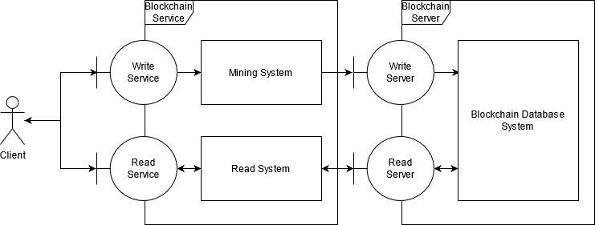
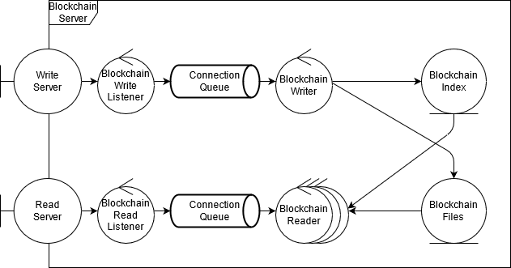
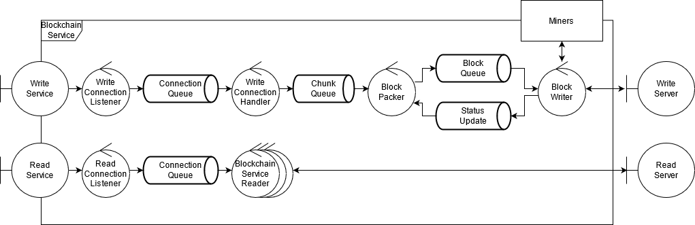
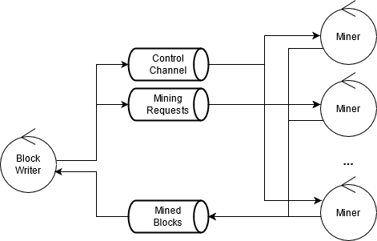

# TP 1: Blockchain Centralizado

## Introducción

En este informe se describen los detalles de un sistema destinado a implementar un blockchain centralizado capaz de almacenar bloques de bytes arbitrarios. Escribir un bloque al blockchain requiere la ejecución de un proceso de minería como prueba de trabajo para limitar la cantidad de bloques que se almacenan por unidad de tiempo. La dificultad de almacenamiento se calcula en forma dinámica dependiendo de la tasa de escritura de bloques.

## Vista de proceso

En la figura 1 se muestra un diagrama de robustez parcial que describe los procesos existentes en el sistema. Existen en principio  dos subsistemas bien diferenciados: el blockchain server y el blockchain service. El primero es el servidor de base de datos que gestiona los archivos de la blockchain, mientras que el segundo expone una interfaz accesible al cliente y se encarga también de gestionar la minería de bloques.

Figura 1: Diagrama de robustez parcial del sistema del sistema.

Los detalles del componente Blockchain Server se detallan en la figura 2. El servidor gestiona los pedidos de lectura y los de escritura en forma independiente. Existe un único escritor que escribe bloques a los archivos de la blockchain, y existe un pool de lectores que gestionan pedidos de lectura por bloques de la blockchain. La blockchain se almacena en un conjunto de archivos que contienen los bloques ("Blockchain Files"), y también se almacena un índice que permite búsquedas rápidas de bloques puntuales ("Blockchain Index").

Figura 2: Diagrama de robustez del servidor de blockchain.

Los detalles del componente Blockchain Service se detallan en la figura 3. Al igual que en el caso del Blockchain Server, las lecturas y las escrituras se gestionan en forma independiente. Para gestionar las lecturas hay un pool de trabajadores que se conectan directamente al Blockchain Server y devuelven los datos solicitados por el cliente, funcionando simplemente como proxy.

Figure 3: Diagrama de robustez del servicio expuesto al usuario.

Para las escrituras, por otro lado, se aplica un tratamiento más complejo. Los componentes del pipeline de escritura se detallan a continuación.

**Blockchain Service Writer**: Este componente recibe las conexiones de los clientes, que proveen chunks (bloques de datos) a ser agregados a la blockchain. El componente extrae el chunk de datos del pedido del usuario y lo ingresa en la cola Chunk Queue. La cola impone límites a la cantidad de chunks que pueden estar en el sistema en un momento dado. El pedido de ingreso de un nuevo chunk resulta en una respuesta por parte de la cola, que puede ser de aceptación o de rechazo. En cualquier caso, el resultado es devuelto al cliente, quien sabrá si el chunk fue aceptado o si deberá intentar nuevamente en el futuro.

**Chunk Queue** : Una cola que almacena chunks de datos a ser escritos a la blockchain. La cola impone un límite configurable a la cantidad de chunks que puede haber en el sistema, rechazando los ingresos en caso de estar llena.

**Block Packer**: Este componente toma chunks de la Chunk Queue y construye bloques para la blockchain en base a ellos. Habiendo construido un bloque, el packer se lo envía al escritor de bloques (Block Writer) a través de una cola de bloques (Block Queue) para darle inicio al proceso de minería. El packer solo construye un nuevo bloque si el sistema de minería está listo para aceptarlo; para ello lee la cola Status Update, recibiendo información sobre la disponibilidad del servicio. Cada vez que ingresa un nuevo chunk a la cola Chunk Queue, el packer verifica si debería construir un nuevo bloque. Suponiendo que el sistema de minería está listo, el packer construirá el bloque si la cantidad de chunks en la cola es superior a una cantidad mínima configurable, para evitar construir bloques demasiado pequeños. Alternativamente, en forma periódica y a un intervalo de tiempo configurable, el packer construirá un bloque con los chunks que estén en la cola, independientemente de si la cantidad supera el mínimo configurado o no (aunque solo si el sistema de minería está listo). Tras enviar un bloque para ser minado, el packer no construirá un bloque nuevo hasta recibir una notificación a través de la cola Status Update indicando que el sistema de minería está nuevamente disponible. Por la cola Status Update el packer también recibe el hash previo y la dificultad actuales necesarias para crear nuevos bloques.

**Block Queue**: Una cola mediante la cual ingresan bloques al sistema de minería.

**Status Update**: Una cola mediante la cual el packer recibe notificaciones de estado del sistema de minería, para saber si está en condiciones de aceptar un nuevo bloque o todavía está minando.

**Block Writer**: Este componente se encarga de gestionar los mineros y los bloques a ser minados, así como de hacer el pedido de escritura al Blockchain Server cuando se cuenta con un bloque minado. Cuando el writer lee un bloque de la cola Block Queue se lo envía a los mineros para que encuentren el nonce adecuado que haga al hash cumplir con los requisitos de dificultad actuales. Habiendo enviado un bloque, el writer esperará la respuesta de los mineros y no aceptará nuevos bloques hasta que los mineros terminen con el bloque actual. Cuando el writer reciba el bloque minado exitosamente, ejecutará el pedido de escritura a la blockchain, detendrá a los mineros, y enviará una notificación por la cola Status Update para indicar que el sistema de minería está libre nuevamente. Luego de ello procederá a esperar un nuevo bloque. A través de la cola Status Update se envía también el nuevo hash previo y la dificultad actual reportados por el Blockchain Server, que el packer utilizará para construir nuevos bloques.

**Miners**: Consiste en un pool de mineros que reciben pedidos de bloques a ser minados. Todos los mineros trabajan en conjunto para minar un único bloque en un instante dado. Cuando alguno de los mineros encuentra un nonce válido que hace al bloque cumplir con los requisitos de dificultad, lo informa al gestor de mineros (el block writer), que procede a detener el proceso de minería y a enviarle el bloque minado al blockchain server.  Los detalles de la comunicación entre el block writer y los mineros se muestran en la figura 4.

El block writer envía pedidos de minería a los mineros a través de una cola Mining Requests. Estos pedidos llegan a todos los mineros. Existe adicionalmente un canal de control que el block writer puede usar para detener el proceso de minería en cualquier momento. Cuando un minero encuentra un bloque válido para el pedido de minería actual, lo escribe a la cola Mined Blocks y se detiene, pasando a esperar un nuevo pedido. Tras pasarle un pedido de minería a los mineros, el block writer espera en la cola Mined Blocks a que alguno termine. Cuando alguno termina, el writer le notifica al resto a través del canal de control para que se detengan. También mandará el bloque al blockchain server para ser escrito y notificará a los servicios upstream que el sistema de minería está listo para recibir un nuevo bloque.

## Vista de desarrollo

## Vista de despliegue

## Vista física

## Casos de uso

