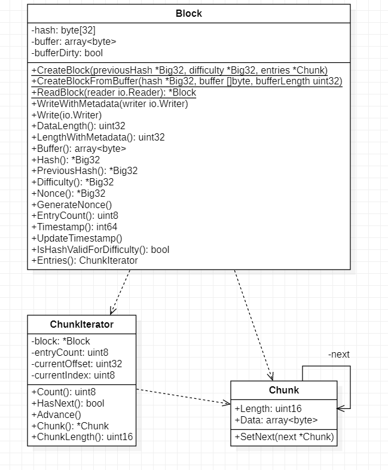
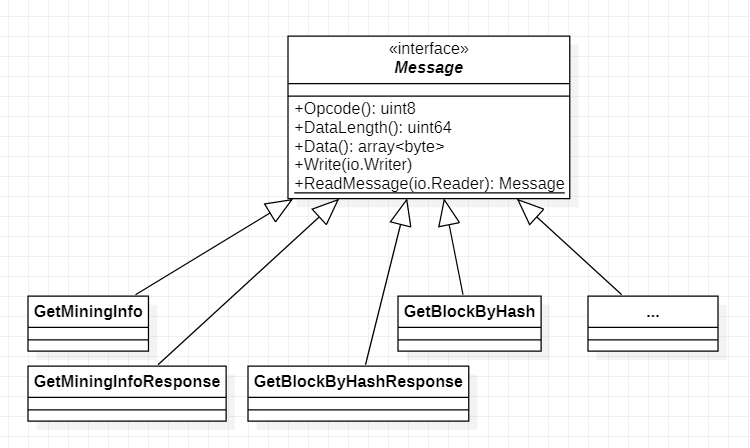
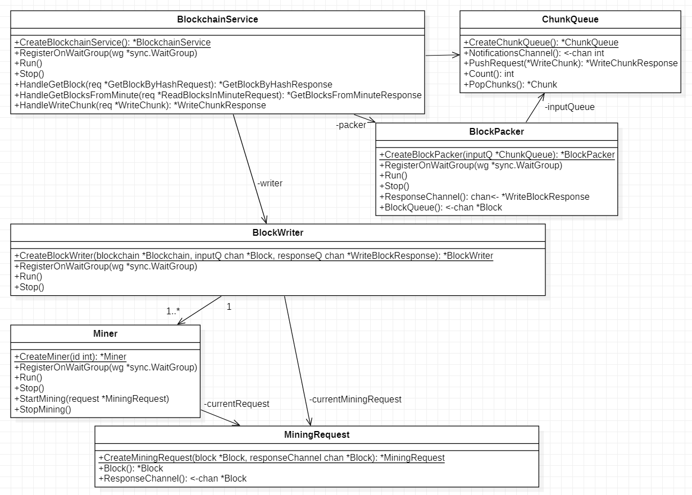
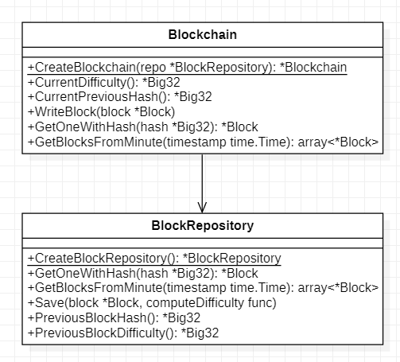

# TP 1: Blockchain Centralizado

## Introducción

En este informe se describen los detalles de un sistema destinado a implementar un blockchain centralizado capaz de almacenar bloques de bytes arbitrarios. Escribir un bloque al blockchain requiere la ejecución de un proceso de minería como prueba de trabajo para limitar la cantidad de bloques que se almacenan por unidad de tiempo. La dificultad de almacenamiento se calcula en forma dinámica dependiendo de la tasa de escritura de bloques.

## Vista lógica

#### Bloques

Un tipo importante compartida por distintos componentes del sistema es el tipo `Block` implementado en el paquete `interface.blockchain`. El diagrama de clases se muestra en la figura L.1.

Figura L.1: Diagrama de clases del tipo Block.

El tipo block representa un bloque en la blockchain. En memoria se almacena simplemente como un buffer, donde cada byte pertenece a algún campo del bloque. El objeto Block, no obstante, expone métodos que permiten obtener representaciones de más alto nivel sin tener que trabajar con el buffer directamente. Estos métodos se encargan internamente de interpretar los bytes en el buffer para construir (y posiblemente cachear) los objetos adecuados. La estructura del bloque en memoria es la siguiente:

* Hash previo (32 bytes)
* Nonce (32 bytes)
* Timestamp (8 bytes)
* EntryCount (1 byte)
* Dificultad (32 bytes)
* Datos dinámicos (chunks), cada uno con la siguiente estructura:
  * Longitud de los datos (2 bytes)
  * Datos.

Fuera del objeto block, las listas de chunks se estructuran como listas enlazadas. Cuando se crea un bloque en base a una lista enlazada de chunks, dichos chunks se escriben al buffer del bloque como secuencias de bytes. Para iterar por los chunks, se puede solicitar un iterador ChunkIterator que internamente sabe recorrer el buffer del bloque e instanciar los chunks adecuados en base a los bytes. Esto facilita instanciar bloques en base a buffers recibidos a través de la red.

Entre las funcionalidades que ofrece el tipo Block está la de escribirse a un io.Writer arbitrario, así como de leerse desde un io.Reader. Cuando un bloque se escribe a un Writer no solo se escribe el buffer del bloque; también se escribe metadata adicional: la longitud total del bloque y su hash. Esto permite leerlo luego usando el método ReadBlock, el cual lee primero la metadata y luego los datos del bloque en sí, para luego construir el objeto Block y devolverlo.

Otros métodos que ofrece el tipo Block son aquellos necesarios para realizar la tarea de minería: GenerateNonce, UpdateTimestamp, Hash, e IsHashValidForDifficulty. Dado un bloque, un minero simplemente debe llamar a estos métodos para realizar la tarea de minería, generando un nuevo nonce, actualizando el timestamp, recomputando el hash, y verificando mediante IsHashValidForDifficulty si el nuevo hash generado cumple con los requisitos de dificultad.

Algo que cabe mencionar es que el tipo Block hace uso de un tipo Big32 que representa un entero de 32 bytes. Un Big32 puede ser construido en base a secuencias de bytes, a objetos tipo big de Go, y a slices. También es posible convertir objetos Big32 a los mencionados tipos.

#### Protocolo

Los distintos componentes del sistema se comunican mediante un protocolo binario específico del sistema. A nivel código el protocolo queda encapsulado en un módulo `interface.message` que tiene a grandes rasgos una estructura como la que se  muestra en la figura L.2.

Figura L.2: Esquema del módulo message

El módulo consiste en una clase raíz `Message` que define un mensaje genérico. Este mensaje genérico cuenta con un opcode de un byte que define el tipo de mensaje, y con un buffer de datos. Luego existen implementaciones concretas del mensaje, cada una proveyendo métodos adicionales para interpretar los distintos bytes del buffer de datos en forma acorde e instanciar objetos de dominio en base a ellos. Genéricamente, todos los mensajes saben escribirse a un Writer arbitrario, y es posible leer mensajes arbitrarios de un Reader arbitrario.

Los mensajes que hacen al protocolo son los siguientes:

* **GetMiningInfo**: Devuelve la información básica necesaria para iniciar el sistema de minería. Concretamente, cuando el blockchain service inicia contacta al blockchain server y le envía este mensaje para obtener la dificultad actual y el hash previo actual, necesarios para crear nuevos bloques. Contiene solo el siguiente campo:

  * Opcode (0x00)

* **GetMiningInfoResponse**: La respuesta al mensaje GetMiningInfo. Contiene los siguientes campos:

  * Opcode (0x01)
  * Hash previo (32 bytes)
  * Dificultad (32 bytes)

* **GetBlockByHash**: Sirve para solicitar un bloque por hash. Contiene los siguientes campos:

  * Opcode (0x02)
  * Hash (32 bytes)

* **GetBlockByHashResponse**: La respuesta al mensaje GetBlockByHash. Contiene los siguientes campos:

  * Opcode (0x03)
  * Encontrado (1 byte): vale 1 si se encontró el bloque, 0 si no.
  * Bloque, una cantidad dinámica de bytes que contiene los siguientes subcampos:
    * Longitud de los datos (4 bytes)
    * Hash (32 bytes)
    * Datos (longitud dinámica). Incluye la cabecera del bloque y los chunks que lo componen.

* **ReadBlocksInMinute**: Sirve para solicitar el listado de bloques generados en un minuto dado. El mensaje contiene los siguientes campos:

  * Opcode (0x04)
  * Timestamp UNIX (8 bytes): es el timestamp del instante contenido en el minuto por el cual se quiere hacer el query.

* **ReadBlocksInMinuteResponse**: Respuesta al mensaje ReadBlocksInMinute.

  * Opcode (0x05)
  * Timestamp (8 bytes): El mismo timestamp provisto en el mensaje de consulta.
  * Cantidad de bloques (4 bytes): La cantidad de bloques encontrados y devueltos.
  * Listado de bloques. Es de longitud dinámica. Por cada bloque se incluye la misma información indicada para el mensaje GetBlockByHashResponse, con lo cual es posible usar el tamaño de cada bloque para iterar por el buffer extrayendo bloques uno por uno.

* **WriteBlock**: Mensaje usado para solicitar la escritura de un bloque a la blockchain. Usado entre el blockchain service y el blockchain server. Contiene los siguientes campos:

  * Opcode (0x06)
  * Bloque con metadata, tal como se describe para el mensaje GetBlockByHashResponse.

* **WriteBlockResponse**

  * Opcode (0x07)
  * Aceptado (1 byte): 1 si el bloque fue aceptado, 0 si el bloque fue rechazado.
  * Nuevo hash previo (32 bytes): debe ser igual al del bloque enviado en el correspondiente WriteBlock.
  * Nueva dificultad (32 bytes): nueva dificultad calculada en forma dinámica por el blockchain server.

* **WriteChunk**: Utilizada para solicitar la escritura de un chunk al sistema. Enviado por los clientes al blockchain service.

  * Opcode (0x08)
  * Longitud del chunk (2 bytes).
  * Datos del chunk (del tamaño indicado en el campo previo).

* **WriteChunkResponse**: Respuesta al mensaje WriteChunk. Contiene los siguientes campos:

  * Opcode (0x09)
  * Accepted (1 byte): 1 si el chunk fue aceptado para eventual escritura a la blockchain, 0 si el chunk fue rechazado.

  

#### Blockchain Service

El diagrama de la figura L.3 representa las clases más importantes del componente Blockchain Service.

Figura L.3

Los procesos principales que hacen al dominio del Blockchain Service son el objeto BlockchainService en sí, el BlockPacker, el BlockWriter, y los mineros (tipo Miner). Estos tipos son "ejecutables," cada uno exponiendo un método Run destinado a ser ejecutado como una corutina. 

En principio, los métodos del objeto BlockchainService son invocados directamente por el servidor que recibe las conexiones de los clientes. Dicho servidor extrae el mensaje (Message) del socket y se lo pasa al BlockchainService invocando alguno de los métodos HandleGetBlock, HandleGetBlocksFromMinute, o HandleWriteChunk. Para el caso de los métodos de lectura, el procesamiento continúa simplemente con una solicitud al Blockchain Server en el mismo thread; para el caso de las escrituras, no obstante, el pedido de tipo WriteChunk se escribe a la ChunkQueue para ser procesado eventualmente por el Packer. Tras dicha escritura el BlockchainService obtiene inmediatamente una respuesta: aceptado o rechazado. Cuando el chunk es aceptado, será eventualmente procesado por el sistema para ser escrito a la blockchain.

El tipo ChunkQueue es simplemente una cola con una capacidad configurable. Cuando recibe un pedido de ingreso de un chunk, la cola devuelve una respuesta inmediata, aceptado o rechazado, como ya se mencionó.  El BlockPacker lee de esta cola y combina todos los chunks obtenidos en un objeto Block, el cual se envía por la cola de salida (la cual se obtiene llamando a su método BlockQueue). El BlockPacker espera que, tras escribir un bloque a la cola packer.BlockQueue(), quien lea de esa cola eventualmente envíe una respuesta por la cola packer.ResponseChannel() indicando que está libre para recibir un nuevo bloque, e indicando el nuevo hash previo y la nueva dificultad para crear nuevos bloques.

Quien lee de la cola packer.BlockQueue() es el BlockWriter, que internamente gestiona un pool de mineros con los cuales se comunica a través de mensajes de tipo MiningRequest. Cuando el BlockWriter recibe un bloque para minar, instancia un objeto MiningRequest pasando el bloque y un canal a través del cual los mineros podrán devolver el bloque cuando este haya sido minado exitosamente. Cuando el BlockWriter recibe una respuesta por parte de algún minero, llama al método StopMining de los mineros restantes, envía el bloque minado al Blockchain Server, y envía la respuesta a través del canal packer.ResponseChannel() para notificar al packer sobre la disponibilidad del sistema de minería y sobre los nuevos datos necesarios para instanciar bloques.

#### Blockchain Server

En términos de tipos, el Blockchain Server es más simple que el Blockchain Service. Los tipos de dominio del primero se muestran en la figura L.4.

Figura L.4: Diagrama de clases del Blockchain Server

El objeto Blockchain expone la funcionalidad necesaria para llevar a cabo las lecturas y las escrituras de bloques. Internamente hace uso de un objeto BlockRepository que abstrae la funcionalidad para interactuar con los archivos de la blockchain.

## Vista de procesos

En la figura P.1 se muestra un diagrama de robustez parcial que describe los procesos existentes en el sistema. Existen en principio  dos subsistemas bien diferenciados: el blockchain server y el blockchain service. El primero es el servidor de base de datos que gestiona los archivos de la blockchain, mientras que el segundo expone una interfaz accesible al cliente y se encarga también de gestionar la minería de bloques.

Figura P.1: Diagrama de robustez parcial del sistema del sistema.

Los detalles del componente Blockchain Server se detallan en la figura P.2. El servidor gestiona los pedidos de lectura y los de escritura en forma independiente. Existe un único escritor que escribe bloques a los archivos de la blockchain, y existe un pool de lectores que gestionan pedidos de lectura por bloques de la blockchain. La blockchain se almacena en un conjunto de archivos que contienen los bloques ("Blockchain Files"), y también se almacena un índice que permite búsquedas rápidas de bloques puntuales ("Blockchain Index").

Figura P.2: Diagrama de robustez del servidor de blockchain.

Los detalles del componente Blockchain Service se detallan en la figura P.3. Al igual que en el caso del Blockchain Server, las lecturas y las escrituras se gestionan en forma independiente. Para gestionar las lecturas hay un pool de trabajadores que se conectan directamente al Blockchain Server y devuelven los datos solicitados por el cliente, funcionando simplemente como proxy.

Figure P.3: Diagrama de robustez del servicio expuesto al usuario.

Para las escrituras, por otro lado, se aplica un tratamiento más complejo. Los componentes del pipeline de escritura se detallan a continuación.

**Blockchain Service Writer**: Este componente recibe las conexiones de los clientes, que proveen chunks (bloques de datos) a ser agregados a la blockchain. El componente extrae el chunk de datos del pedido del usuario y lo ingresa en la cola Chunk Queue. La cola impone límites a la cantidad de chunks que pueden estar en el sistema en un momento dado. El pedido de ingreso de un nuevo chunk resulta en una respuesta por parte de la cola, que puede ser de aceptación o de rechazo. En cualquier caso, el resultado es devuelto al cliente, quien sabrá si el chunk fue aceptado o si deberá intentar nuevamente en el futuro.

**Chunk Queue** : Una cola que almacena chunks de datos a ser escritos a la blockchain. La cola impone un límite configurable a la cantidad de chunks que puede haber en el sistema, rechazando los ingresos en caso de estar llena.

**Block Packer**: Este componente toma chunks de la Chunk Queue y construye bloques para la blockchain en base a ellos. Habiendo construido un bloque, el packer se lo envía al escritor de bloques (Block Writer) a través de una cola de bloques (Block Queue) para darle inicio al proceso de minería. El packer solo construye un nuevo bloque si el sistema de minería está listo para aceptarlo; para ello lee la cola Status Update, recibiendo información sobre la disponibilidad del servicio. Cada vez que ingresa un nuevo chunk a la cola Chunk Queue, el packer verifica si debería construir un nuevo bloque. Suponiendo que el sistema de minería está listo, el packer construirá el bloque si la cantidad de chunks en la cola es superior a una cantidad mínima configurable, para evitar construir bloques demasiado pequeños. Alternativamente, en forma periódica y a un intervalo de tiempo configurable, el packer construirá un bloque con los chunks que estén en la cola, independientemente de si la cantidad supera el mínimo configurado o no (aunque solo si el sistema de minería está listo). Tras enviar un bloque para ser minado, el packer no construirá un bloque nuevo hasta recibir una notificación a través de la cola Status Update indicando que el sistema de minería está nuevamente disponible. Por la cola Status Update el packer también recibe el hash previo y la dificultad actuales necesarias para crear nuevos bloques.

**Block Queue**: Una cola mediante la cual ingresan bloques al sistema de minería.

**Status Update**: Una cola mediante la cual el packer recibe notificaciones de estado del sistema de minería, para saber si está en condiciones de aceptar un nuevo bloque o todavía está minando.

**Block Writer**: Este componente se encarga de gestionar los mineros y los bloques a ser minados, así como de hacer el pedido de escritura al Blockchain Server cuando se cuenta con un bloque minado. Cuando el writer lee un bloque de la cola Block Queue se lo envía a los mineros para que encuentren el nonce adecuado que haga al hash cumplir con los requisitos de dificultad actuales. Habiendo enviado un bloque, el writer esperará la respuesta de los mineros y no aceptará nuevos bloques hasta que los mineros terminen con el bloque actual. Cuando el writer reciba el bloque minado exitosamente, ejecutará el pedido de escritura a la blockchain, detendrá a los mineros, y enviará una notificación por la cola Status Update para indicar que el sistema de minería está libre nuevamente. Luego de ello procederá a esperar un nuevo bloque. A través de la cola Status Update se envía también el nuevo hash previo y la dificultad actual reportados por el Blockchain Server, que el packer utilizará para construir nuevos bloques.

**Miners**: Consiste en un pool de mineros que reciben pedidos de bloques a ser minados. Todos los mineros trabajan en conjunto para minar un único bloque en un instante dado. Cuando alguno de los mineros encuentra un nonce válido que hace al bloque cumplir con los requisitos de dificultad, lo informa al gestor de mineros (el block writer), que procede a detener el proceso de minería y a enviarle el bloque minado al blockchain server.  Los detalles de la comunicación entre el block writer y los mineros se muestran en la figura P.4.

Figura P.4: Diagrama de robustez de los mineros.

El block writer envía pedidos de minería a los mineros a través de una cola Mining Requests. Estos pedidos llegan a todos los mineros. Existe adicionalmente un canal de control que el block writer puede usar para detener el proceso de minería en cualquier momento. Cuando un minero encuentra un bloque válido para el pedido de minería actual, lo escribe a la cola Mined Blocks y se detiene, pasando a esperar un nuevo pedido. Tras pasarle un pedido de minería a los mineros, el block writer espera en la cola Mined Blocks a que alguno termine. Cuando alguno termina, el writer le notifica al resto a través del canal de control para que se detengan. También mandará el bloque al blockchain server para ser escrito y notificará a los servicios upstream que el sistema de minería está listo para recibir un nuevo bloque.

## Vista de desarrollo

El programa está escrito como un único binario que ejecuta el cliente, el blockchain service o el blockchain server dependiendo de los argumentos provistos. Los subdirectorios en el directorio de código son los siguientes:

* **common**: Incluye código común pensado para ser compartido (e.g. logging, configuración). Incluye un servidor multihilo genérico utilizado por el blockchain service y por el blockchain server.
* **interface**: Incluye código propio del sistema de blockchain, común a varios procesos. Define, por ejemplo, el tipo Block, el tipo Message y sus implementaciones concretas, y métodos para leer de y escribir a sockets en forma segura. 
* **node**: En este directorio se implementan las unidades ejecutables que hacen al sistema (blockchain service, blockchain server y el cliente). En cada directorio hay un subdirectorio node que incluye un archivo node.go, que corresponde al main thread del programa en cuestión.
  * blockchain
  * client
  * service

## Casos de uso

#### Escritura de un chunk a la blockchain

Para escribir un nuevo bloque a la blockchain se debe ejecutar el cliente pasando los argumentos `write <data>` donde `<data>` es el contenido del chunk. En principio, el cliente solo acepta strings, aunque el protocolo soporta cualquier secuencia de bytes. Habiendo iniciado el cliente, la secuencia de pasos que ocurre es la siguiente:

1. El cliente instancia un objeto Chunk y luego un pedido WriteChunk que representa la solicitud de escritura.
2. El cliente se conecta al blockchain service en el puerto de escritura y envía el mensaje WriteChunk a través de la conexión.
3. Habiendo el Write Connection Listener del blockchain service aceptado la conexión, el Write Connection Handler extraerá el pedido WriteChunk del canal de comunicación y escribirá el objeto Chunk a la cola Chunk Queue. El proceso inmediatamente recibirá una respuesta por parte de la cola, la cual podrá ser devuelta al cliente. De haber sido el chunk aceptado, será procesado eventualmente.
4. El Block Packer del blockchain service eventualmente tomará el Chunk de la cola y lo combinará con otros que estuvieran también acolados para construir un objeto Block. Dicho objeto será ingresado a la cola Block Queue. Antes de aceptar nuevos pedidos, el Block Packer esperará recibir una respuesta a través de la cola Status Update que indique que el sistema de minería downstream está listo para aceptar un nuevo bloque. Adicionalmente, la respuesta incluirá información necesaria para construir un nuevo bloque en el futuro (el hash previo y la dificultad).
5. El proceso Block Writer tomará el bloque de la cola Block Queue y en base a él construirá un objeto MiningRequest y con un canal limpio por el cual los mineros podrán enviar el bloque minado. Dicho request será enviado a los mineros a través de la cola Mining Requests. El Block Writer se quedará esperando luego en la cola Mined Blocks hasta que algún minero envíe el bloque minado exitosamente.
6. Los mineros intentarán repetidamente regenerar el nonce y calcular el hash hasta encontrar uno que cumpla con los requisitos de dificultad. En tal caso, el bloque será escrito a la cola Mined Blocks.
7. El Block Writer recibirá el bloque minado a través de la cola Mined Blocks y acto seguido procederá a construir un pedido WriteBlock para el blockchain server. Iniciará entonces la conexión al puerto de escritura del blockchain server y enviará el pedido. 
8. El blockchain server aceptará la conexión, y el proceso Blockchain Writer extraerá el pedido WriteBlock del canal de comunicación. El bloque en cuestión será escrito a la blockchain de la siguiente forma: en base al hash del bloque se determinará en qué archivo ha de ser almacenado el bloque. En base al nombre del archivo se obtendrá un lock (existe un mapa de nombres de archivo a locks en memoria). Luego se procederá con la escritura per se. Luego de la primera escritura el lock se libera, pero se repite un procedimiento similar para el archivo de índices. Esto implica que las búsquedas por hash y por intervalo de tiempo no son consistentes entre ellas, sino eventualmente consistentes. En otras palabras, el bloque puede ser escrito a la blockchain, resultando en la posibilidad de identificarlo buscando por intervalo de tiempo, pero no al índice, resultando en una búsqueda fallida cuando se busca por hash. En cualquier caso, tras la escritura el blockchain server retornará una respuesta al blockchain service con el nuevo hash y con la nueva dificultad.
9. Habiendo recibido la respuesta y, confirmada la escritura aceptada, el Block Writer detendrá la minería de todos los mineros, enviará el WriteBlockResponse recibido del blockchain server a través de la cola Status Update, y procederá a esperar un nuevo bloque en la cola Block Queue.
10. El Block Packer volverá a escuchar por nuevos chunks en la Chunk Queue, repitiendo el proceso de minería y escritura de haber suficientes chunks acolados.

#### Pedidos de lectura

Para buscar un bloque por hash, hay que ejecutar el cliente pasando los argumentos `block <hash hex>` donde `<hash hex>` es un hex string de 64 caracteres (32 bytes) e.g. `aabbccdd...` que indica el hash del bloque por el que buscar. Para listar todos los bloques generados en un minuto dado, el cliente debe recibir los comandos `minute <timestamp>` donde `<timestamp>` es un timestamp de UNIX (escrito como un entero). Ambos pedidos serán procesado de la siguiente forma:

1. El cliente instanciará un objeto GetChunkByHashRequest con el hash adecuado, o un ReadBlocksInMinute con el timestamp adecuado, dependiendo del tipo de pedido y se conectará al servidor de lectura del blockchain service. Procederá luego a enviar el pedido a través del socket.
2. El Blockchain Read Listener aceptará la conexión y la pasará a través de una cola de conexiones para ser eventualmente tomada por alguno de entre un pool de trabajadores encargados de procesar pedidos de lectura. Un trabajador Blockchain Service Reader dado tomará la conexión, extraerá el pedido del canal de comunicación, y hará un forward al blockchain server, actuando simplemente como proxy.
3. El Blockchain Read Listener en el blockchain server recibirá la conexión y la enviará a través de una cola de conexiones. Un worker encargado de procesar pedidos de lectura recibirá la conexión y extraerá el mensaje correspondiente del canal. Dependiendo del tipo de mensaje se hará una búsqueda en el Blockchain Index para el caso de GetChunkByHashRequest o en los archivos de la blockchain (Blockchain Files) para el caso de un pedido ReadBlocksInMinute. Ambos artefactos representan un conjunto de archivos, y el nombre del archivo concreto a abrir será determinado en base a los parámetros del pedido (hash o timestamp). En cualquier caso, el servidor retornará eventualmente una respuesta correspondiente al pedido.
4. El Blockchain Service Reader que ejecutó el pedido recibirá la respuesta y se la enviará al cliente a través de la conexión todavía abierta.

#### Pedido de estadísticas de minería

TODO
